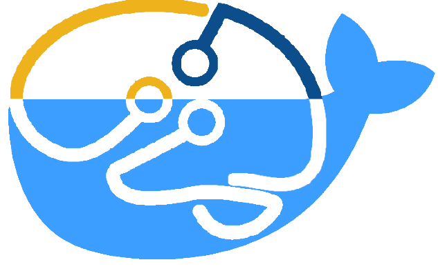

# TrendsSetter
 

This repository contains templates and recommendations for Docker Images used for NeuroImaging at TReNDs. 

## The Base Template

For more details, please read the [README.md](./BASE/README.md) in the `BASE` sub-directory. 

The base template includes an example application written in python for validating and performing simple queries on directories made to follow the [BIDS](https://bids-specification.readthedocs.io/en/stable/) standard. The purpose of this template is not for production use, but is a basic example for creating Dockerfiles for NeuroImaging, which follows the [SPEC](../trendssetter_spec_current.pdf). 

The [Dockerfile](./Dockerfile) for this application includes basic dependencies, a miniconda installation, and an example of providing an entrypoint for running an application in docker. For more details on the design of the template please read the [SPEC](../trendssetter_spec_current.pdf).

### Example Usage

Assuming you have built a copy of the BASE template on your machine, you can run the example in `examples/BASE` to show how the image can be executed in practice. 

## Contributing your Own Image

#### Approach 0: Start from Scratch
If the template is too far from the needs of your image, a new image may be created as long as it adheres to the [SPEC](../trendssetter_spec_current.pdf). Custom images may take longer to review. 

#### Approach 1: Modify the Template

This is the recommended approach if you want more control over your image. The BASE template (found in the [BASE](directory) of this repo) implements the design principles in the [SPEC](../trendssetter_spec_current.pdf), and can be easily modified to various use-cases. You should document your changes both in the pull-request to this repo, and in the **README.md** for your image. 

#### Approach 2: Inherit the Template

If your image utilizes all of the dependencies and basic practices of the BASE image, but only needs modifications to the dockerized application, run scripts, etc, it is recommended that you simple inherit the BASE template in your own Dockerfile. This can be done by starting your Dockerfile with the tag

`FROM trendscenter/TrendsSetter-BASE`